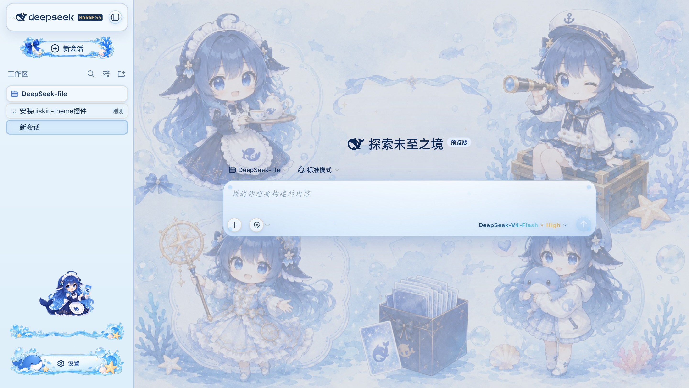

# uiskin-theme — Blue Glass Theme（海洋幻想主题）

DeepSeek Harness Web 的**静态插件包（profile bundle）**：海洋背景、玻璃气泡、海洋侧边栏、鲸鱼设置按钮、炫彩模型文字。

与动态插件（`cordis_define` 现场定义、重启即丢）不同，本包以 npm 包形式装进 profile，**每次启动自动加载，重启不丢，无需人工批准**。



> **许可证**：本主题为原创作品，**保留所有权利（All Rights Reserved）**，非开源协议。
> 未经作者书面许可，不得复制、修改、再分发、二次创作或用于商业用途；仅允许按原样安装与个人使用。

## 安装

需要已安装 Node.js 与 [pnpm](https://pnpm.io/installation)，并已能运行 `dsh` CLI（`npx @deepseek-ai/dsh` 亦可）。

```bash
# 从 GitHub 安装（把 USERNAME 换成你的 GitHub 用户名）
dsh plugin --profile web add github:USERNAME/uiskin-theme

# 或指定分支 / 提交
dsh plugin --profile web add github:USERNAME/uiskin-theme#main
```

装完后重启 `dsh web`（或下次启动时）即自动生效。

安装做了什么：`dsh plugin` 会在 `~/.dsh/profiles/web/` 里执行 pnpm 安装，识别到包的 `dsh.bundle.patch` 声明后把它加入 `dsh.profile.bundles`，启动时由 boot 加载。

## 卸载

```bash
dsh plugin --profile web remove uiskin-theme
```

## 工作原理

```
package.json        dsh.bundle.patch → cordis.patch.yml（注册启动行）
                    dsh.client        → 声明浏览器半 /plugins/uiskin-theme/client.js
cordis.patch.yml    - insert: [{ id: uiskin-theme, name: uiskin-theme }]
lib/index.js        Host 半：空实现（皮肤全在浏览器侧）
lib/client.js       浏览器半：注入 CSS + 内联 data URI 素材 + 槽位组件
assets/             原始图片（构建时内联为 base64，运行时不读磁盘、无绝对路径）
```

## 本地开发 / 重新构建

```bash
npm install        # 仅安装 scripts 运行所需（本包无运行时依赖）
npm run build      # 把 assets/ 内联成 data URI，重新生成 lib/client.js
```

修改皮肤请编辑 `scripts/client.template.js` 里的 CSS / 组件，或替换 `assets/` 下的图片后重新构建。**改完记得把 `lib/client.js` 一起提交**——别人从 git 安装时不会（也不需要）执行构建脚本。

## 注意事项

- 素材以 base64 内联在 `lib/client.js`（约 1.1 MB），加载一次即可，适合皮肤类小图片。若想更小，可先把 `assets/` 里的图压缩再构建。
- DSH 目前是 `0.1.0-rc` 预发布版本，插件 API（`dsh.bundle` / `dsh.client` / slots / theme 服务）可能随版本调整；升级 DSH 后如遇兼容问题，关注本仓库的更新。
- 本包只依赖 `@deepseek-ai/cordis`（peer）与 `react`（peer），无需 `allowBuilds` 放行构建脚本。
## 其他
-制作不易，您的支持才是我们开发的动力，希望大家喜欢的动动小手点一个star，如果想要给予我们一点小小的经费支持或者提出一些建议和Bug请联系shutiaochou@gmail.com。
